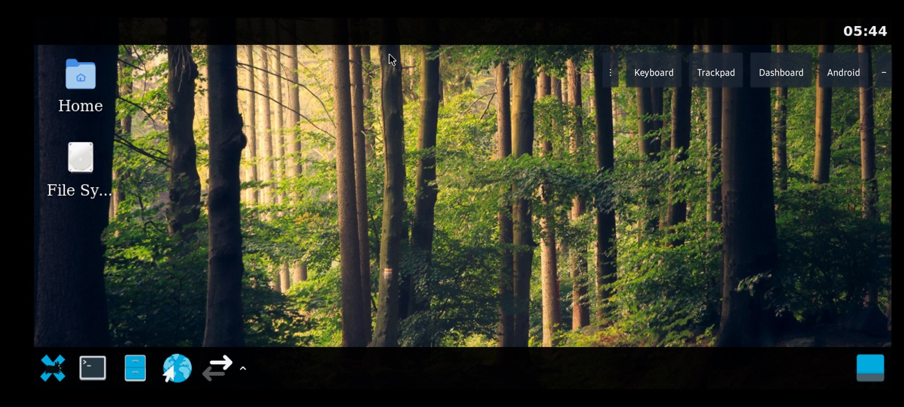
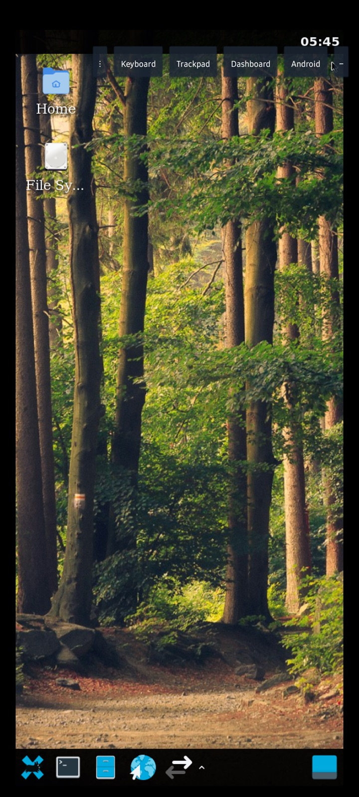
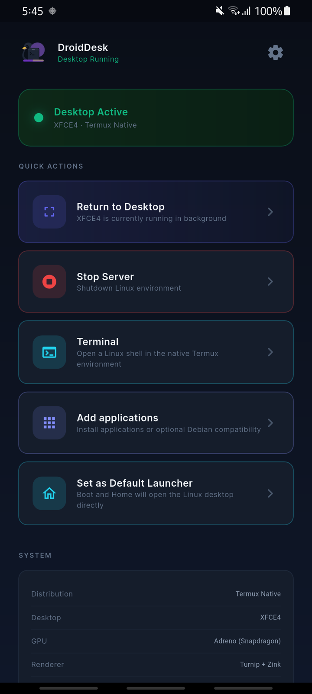
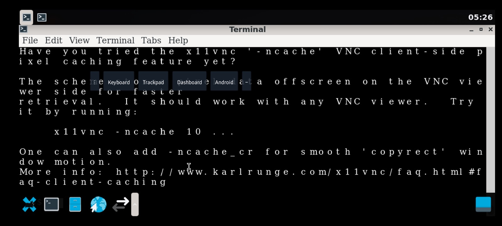

# DroidDesk Launcher

Full Linux desktop on ARM64 Android — not a terminal app, not an emulator. Native kernel access, embedded X11, and an optional **Android home launcher** so boot and Home open the desktop directly.

This repository (`DroidDeskLauncher`) builds on [upstream DroidDesk](https://github.com/orailnoor/DroidDesk) with phone-first UX: home routing, a touch-oriented XFCE layout, floating controls, and safer session start.

> [!IMPORTANT]
> DroidDesk is an independent GPL-3.0 open-source project that incorporates
> modified Termux:X11 components. It is not affiliated with or endorsed by
> Termux, Termux:X11, TUR, Canonical, or Ubuntu.
>
> - **This fork (launcher):** <https://github.com/anugotta/DroidDeskLauncher>
> - **Upstream project:** <https://github.com/orailnoor/DroidDesk>
> - **Termux:X11 upstream:** <https://github.com/termux/termux-x11>

## Screenshots

<p align="center">
  
  <br/>
  <em>Linux desktop (XFCE) in landscape — Unsplash wallpaper, bottom dock, floating bar, trackpad mode</em>
</p>

<p align="center">
  
  &nbsp;
  
  <br/>
  <em>Portrait desktop · Flutter dashboard (return, stop, set as default launcher)</em>
</p>

<p align="center">
  
  <br/>
  <em>Share VNC — live session on port 5901; switches to 1920×1080 for Mac / Pi / laptop viewers</em>
</p>

## What’s new in this fork

Compared with the original DroidDesk app experience, this launcher fork focuses on **using Linux as a phone home screen** and fixing rough edges on real devices (tested on Samsung Galaxy A70 / One UI).

### Home launcher mode

| Behavior | Detail |
|----------|--------|
| Boot / Home | Routes to the Linux desktop when setup is complete |
| Incomplete setup / failure | Falls back to the Flutter dashboard with a clear error path |
| Overlay **Dashboard** | Returns to Flutter (apps, terminal, settings, stop server) |
| Overlay **Android** | Leaves Linux for the **stock Android home** (not just settings) |
| Long-press **Android** / **Dashboard** | Opens the system default-home / role picker |

Set DroidDesk as the default home app from the dashboard (**Set as Default Launcher**). For casual use, leave the stock launcher as default and open DroidDesk from the app drawer.

### Phone desktop UX

- **Bottom dock** — Applications menu, Terminal, Files, Browser, **VNC** (submenu: Share / Connect / Stop / Show IP)
- **Applications menu** — same VNC helpers plus **Fit Windows to Screen**
- **Top tasklist + clock** — Window list and readable clock on the dark panel
- **Panel / menu contrast** — Light text and symbolic icons so menus stay readable on light popovers
- **Wallpapers** — Bundled Unsplash desktop backgrounds (see `CREDITS.txt` in assets)
- **Safe-area letterboxing** — Black borders so rounded corners / notches don’t clip the desktop
- **Orientation** — Desktop resizes on rotate; windows rematch to the new viewport
- **Direct touch / Trackpad / Touchscreen** — Floating bar cycles modes; **Trackpad is the default**
- **Soft keyboard** — Floating **Keyboard** button (true text-field auto-IME isn’t available over X11)

### VNC to Mac / Pi / laptop

Phones without USB-C DisplayPort Alt Mode can share the live desktop over Wi‑Fi or USB tethering:

1. On the dock, open **VNC** → **Share VNC**.
2. The X display switches to **1920×1080** so viewers get a normal desktop (not a tiny phone-scaled frame).
3. Connect from a VNC client (e.g. TigerVNC) to `PHONE_IP:5901` — use **Show IP** if needed.
4. **Stop VNC Share** restores the phone-scaled layout.

**Expect some lag over VNC** — the phone encodes a 1080p framebuffer. USB tethering is usually snappier than Wi‑Fi. Wired **USB-C HDMI / DeX** on DP Alt Mode phones is the lag-free path when the hardware supports it.

### Launch reliability

- Foreground service starts before the desktop session where needed
- X11 / Lorie surface starts without waiting only on focus (reduces black screens on Home / boot)
- XFCE mobile profile installs atomically (marker written only after configs succeed)
- Dock helper scripts use a real bash shebang (avoids Termux `#!/bin/sh` permission errors)
- Avoids panel restart paths that triggered GDBus “Failed to restart the panel” dialogs

> [!TIP]
> On Samsung / One UI, set DroidDesk battery usage to **Unrestricted** so the X11 session is less likely to be killed in the background.

## Video (upstream)

[](https://youtu.be/QCr4WWsfVv8)

## What this actually runs

Tested and confirmed working on the DroidDesk stack:

- **LibreOffice** — documents, spreadsheets, presentations
- **VS Code** — full editor with extensions
- **Claude Code** — AI coding agent in the terminal
- **Blender** — installs and opens (heavy on mobile GPUs)
- **Wireshark** / **Metasploit** — via Proot / apt where needed
- **Local AI** — offline LLM inference on-device

If it runs on Ubuntu/Termux GUI packages, it can run here.

## How it works

- **Standalone APK (recommended):** Embedded Termux:X11 (`libXlorie.so`) in a dedicated process; Linux on `DISPLAY=:0`. No separate Termux:X11 app required.
  - **Non-root:** App-private Termux userspace + X11/TUR packages (main desktop path does not use PRoot).
  - **Root:** Ubuntu filesystem via `chroot`.
  - **GPU:** Adreno → Turnip/Zink when available; otherwise Mesa software rendering.
- **Classic Termux scripts:** Still available for users who prefer a Termux + Termux:X11 install (see below).
- **Proot:** Optional Ubuntu/Debian/Kali container for packages not in TUR; menu sync can surface those apps on the desktop.

## Requirements

- Android phone (ARM64)
- For **standalone APK:** nothing else — X11 is embedded
- For **classic script path:** [Termux (F-Droid)](https://f-droid.org/en/packages/com.termux/) + [Termux-X11 nightly](https://github.com/termux/termux-x11/releases/tag/nightly)

### Optional monitor output

| Path | When to use |
|------|-------------|
| USB-C HDMI / DeX | Phones with DisplayPort Alt Mode — local scanout, essentially lag-free |
| VNC (dock **Share VNC**) | Mac / laptop / any VNC viewer on the same network — some lag expected |
| Raspberry Pi VNC bridge | Headless Pi tether + viewer — see [Pi bridge](#raspberry-pi-monitor-bridge) |

## Installation

### Standalone APK (recommended)

1. Download a release APK or build:

   ```bash
   cd app
   flutter pub get
   flutter build apk --release
   ```

   Output: `app/build/app/outputs/flutter-apk/app-release.apk`

2. Sideload and open **DroidDesk**.
3. Finish the setup wizard.
4. Optionally: **Set as Default Launcher** on the dashboard.
5. Use the floating bar: **Keyboard** · input mode · **Dashboard** · **Android**.

### Classic Termux path

<details>
<summary>Termux + setup script (upstream-compatible)</summary>

1. Install Termux from F-Droid (not Play Store).
2. Install [Termux-X11 nightly](https://github.com/termux/termux-x11/releases/tag/nightly).
3. In Termux:

   ```bash
   curl -sL https://raw.githubusercontent.com/orailnoor/DroidDesk/main/termux-linux-setup.sh -o setup.sh
   bash setup.sh
   ```

4. Start desktop: `bash ~/start-x11.sh`, then open Termux-X11.

| Command | Purpose |
|---------|---------|
| `bash ~/start-x11.sh` | Desktop via Termux-X11 |
| `bash ~/start-vnc.sh` | Desktop via VNC |
| `bash ~/start-proot.sh` | Proot Linux shell |
| `bash ~/proot-menu-sync.sh` | Sync Proot apps to the menu |
| `bash ~/stop-linux.sh` | Stop sessions |

</details>

## Raspberry Pi monitor bridge

For phones without USB-C display output, a Pi Zero 2W can tether over USB and show the phone desktop with a VNC viewer. Scripts: `pi-launch_phone.sh` (see upstream docs for flash / auto-boot notes). Prefer on-phone X11 when you are not using an external monitor. The dock **Share VNC** path (1920×1080) works the same for a Pi viewer on the LAN.

## Notes

> [!WARNING]
> **Disable child-process restrictions** in Developer Options on ROMs that kill background processes (MIUI, One UI, stock Android 13+). Otherwise long-running X11 sessions may die without warning.

- On-phone X11 and USB-C external display are faster than VNC; use VNC for remote access or phones without wired video out.
- GPU acceleration is strongest on Adreno (Snapdragon); other GPUs fall back to software rendering.
- Electron/Chromium apps as root may need `--no-sandbox` — see [APP_TROUBLESHOOTING.md](APP_TROUBLESHOOTING.md).

## Credits

Created by [orailnoor](https://youtube.com/@orailnoor). Home launcher mode and phone UX maintained in this fork ([anugotta/DroidDeskLauncher](https://github.com/anugotta/DroidDeskLauncher)).

Bundled wallpapers: [Unsplash](https://unsplash.com) contributors — see `app/android/app/src/main/assets/droiddesk/wallpapers/CREDITS.txt`.

## License and third-party software

DroidDesk is independent software licensed under [GNU GPL version 3 only](LICENSE). It is not affiliated with or endorsed by Termux, Termux:X11, TUR, Canonical, Ubuntu, or other upstream projects.

See:

- [Notices and attribution](NOTICE.md)
- [Third-party software inventory](THIRD_PARTY_NOTICES.md)
- [Release compliance status](COMPLIANCE.md)

The compliance checklist may still list unresolved provenance / reproducible-build items. Do not describe a binary release as fully compliant until those items are complete.
